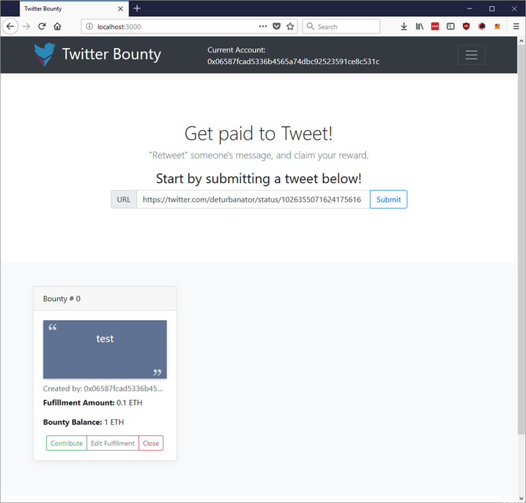
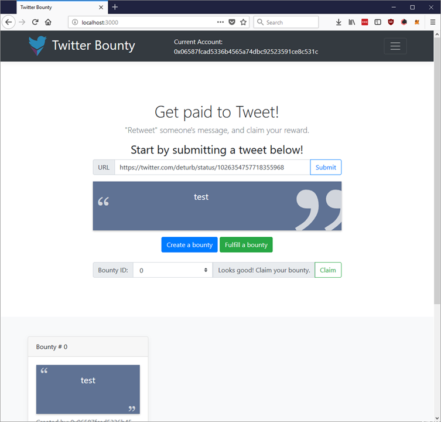
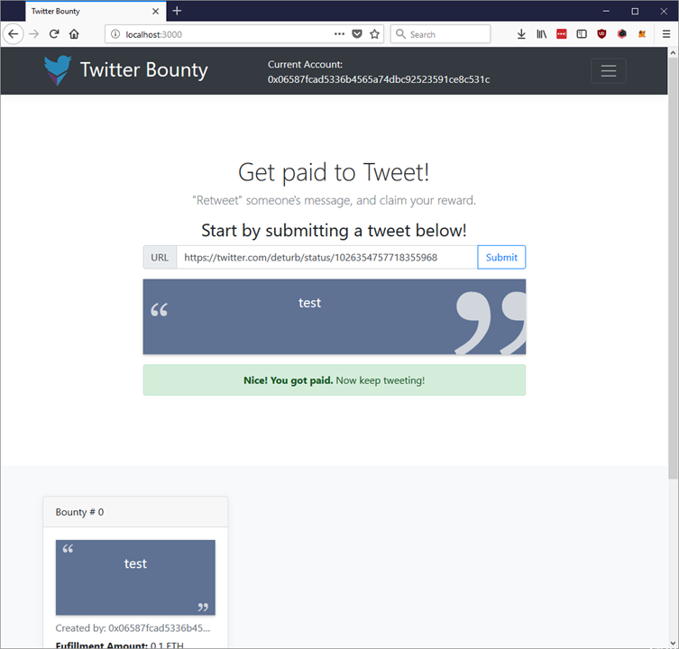
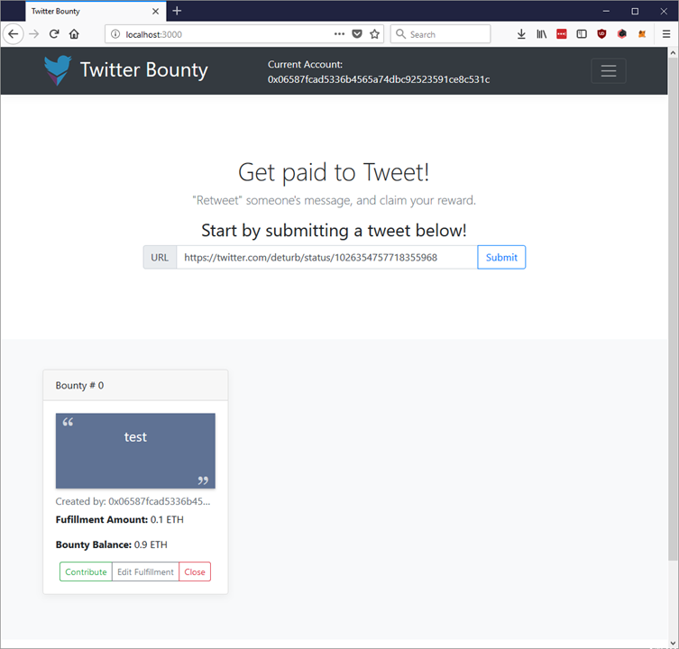

# Twitter Bounty Guided Walkthrough

1) Once the `lite-server` has been initiated, the web interface should be accessible at `http://localhost:3000/`

    

2) Start by submitting this tweet to be oraclized: `https://twitter.com/deturbanator/status/1026355071624175616`

    You should be prompted by MetaMask to submit a transaction for this request.

    

3) It will take a little while for the oracle to retrieve the tweet. You should see a loading screen in the meantime:

    

4) Once the oracle has sucessfully stored the tweet, you should see the option to "Create a bounty" or "Fulfill a bounty"

    

5) Click "Create a bounty" and fill in a reward amount and the initial deposit. Then press "create", which should initiate another MetaMask transaction:

    

6) Once the bounty is created, you will see it appear on the screen:

    

7) Now let's fulfill the bounty. Submit this tweet to be oraclized: `https://twitter.com/deturb/status/1026354757718355968`

    Then press "Fulfill a bounty" and select "Bounty ID: 0". You should see a message saying that the tweets match!

    

8) Press "Claim" and you should see a success message saying that you have been paid:

    

9) If you look at the bounty again, you will see that the "Bounty Balance" has been reduced by the "Fulfillment Amount":

    

10) Now let's see what would happen if the fulfillment would fail. Oraclize this tweet: `https://twitter.com/deturb/status/1026354801381203968`

    If you try to fulfill the bounty using this tweet, you should see that the website tells you that "This tweet won't work...", and the "Claim" button is disabled.

    

## Known Issues

* The Oraclize process may run out of gas with "large" tweets. This includes tweets with a lot of text or with links and other HTML formatting. In that case, you will get an error message in the `ethereum-bridge` and a timeout error on the website:

    

* Sometimes the Oraclize process succeeds, but the resulting text is empty: `""`. To the contract, an empty string is the same as if the tweet was never oraclized. The page will timeout with an error message same as before.

* The Oraclize XPath parsing will return an array of strings if there is HTML formatting in the tweet. This formatting is handled using `JSON.parse()` in the UX when creating a bounty. But the background contract still validates based on this array; however, if the user uses the exact same text, they should get the same result.

    

## Find other issues? Report them [here](https://github.com/shawntabrizi/Ethereum-Twitter-Bounty/issues)!
